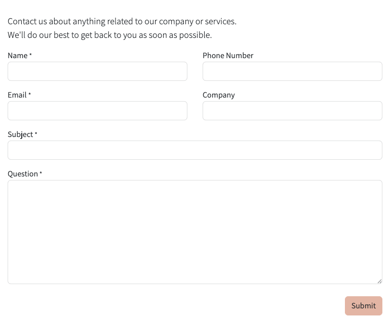
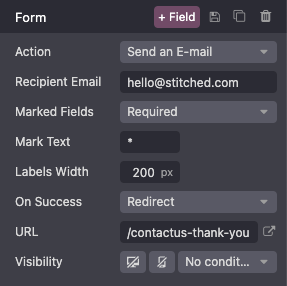
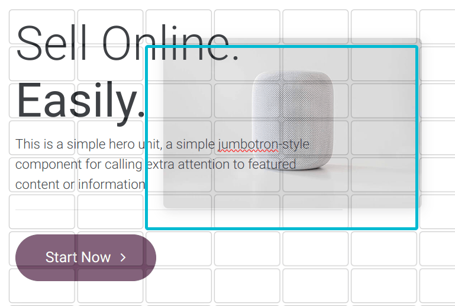

:show-content:

===============
Building blocks
===============

You can design your website by dragging and dropping building blocks. Two types of building blocks
are available: :guilabel:`Categories` and :guilabel:`Inner Content.`

.. seealso::
   `Odoo Tutorial: Design your website: text and colours <https://www.odoo.com/slides/slide/design-your-website-text-and-colors-6930?fullscreen=1>`_

Add a building block
====================

To add a block, click :guilabel:`Edit`, then drag and drop the desired building block into the
appropriate location on the page. When clicking on a category block, a pop-up appears, allowing you
to select between multiple templates for each category. Save when you’re finished.

.. tip::
   You can also search for a block using the search bar.

You can add as many :guilabel:`Category` blocks as you want on a page but keep in mind that a short
and efficient page works best. Once your category block is placed, you can drag and drop
:guilabel:`Inner content` within it.

   .. image:: building_blocks/insert-a-block.png
      :alt: Pop-up block selection

  .. note::
     Access to certain blocks requires the installation of their respective application or module
     (e.g., eCommerce, Blog).

The :guilabel:`Inner content` blocks allow you to add elements such as videos, images, social
media buttons, and so on, into pre-existing category blocks.

.. example::
   Add all your social media accounts in one place with the Inner content Social Media block.
   Simply :icon:`fa-toggle-on` or :icon:`fa-toggle-off` the desired platform and copy/paste your
   account URL.

   .. image:: building_blocks/social-media-inner-content.png
      :alt: Social Media inner content block

.. _building_blocks/form:

Form
----

The :guilabel:`Form` block is used to collect information from website visitors and create records
in your database.

Action
~~~~~~

By default, when the form is submitted, an email is automatically sent containing the information
entered by the visitor.
Depending on the apps installed on your database, additional actions that can automatically create
records may become available. To choose a different action, click :guilabel:`Edit`, click the form,
navigate to the :guilabel:`Customize` tab, and select the desired :guilabel:`Action`:

- :guilabel:`Apply for a Job` (:doc:`Recruitment </applications/hr/recruitment>`)
- :guilabel:`Create a Customer` (:doc:`eCommerce <../../ecommerce>`)
- :guilabel:`Create a Ticket` (:doc:`Helpdesk </applications/services/helpdesk>`)
- :guilabel:`Create an Opportunity` (:doc:`CRM </applications/sales/crm>`)
- :guilabel:`Subscribe to Newsletter` (:doc:`Email Marketing </applications/marketing/email_marketing>`)
- :guilabel:`Create a Task` (:doc:`Project </applications/services/project>`)

Select another action with the :guilabel:`Action` field found under the :guilabel:`Customize` tab's
:guilabel:`Form` section.

By default, submitting the form redirects visitors to a *Thank you* page. Use the :guilabel:`URL`
field to send them to a different page. Alternatively, you can choose not to redirect and keep
visitors on the form's page by selecting :guilabel:`Nothing` or :guilabel:`Show Message` in the
:guilabel:`On Success` field.

Fields
~~~~~~

To add a new field to the form, click the :guilabel:`+ Field` button found next to the Customize
tab's :guilabel:`Form` or :guilabel:`Field` section. By default, new fields are *text* fields. To
change the type, use the :guilabel:`Type` field and select an option under the :guilabel:`Custom
Field` heading.

To add a new field to the form, navigate to the :guilabel:`Customize tab` and click the
:guilabel:`+ Field` button next to the :guilabel:`Form` or :guilabel:`Field` section.

.. note::
   By default, new fields are text fields. Use the :guilabel:`Type` field to select another field
   type.

To modify the new (or any other) field on the form, select the field, then use the options available
in the :guilabel:`Field` section of the :guilabel:`Customize` tab. For example, you can:

- Change the field :guilabel:`Type`.

  .. tip::
     It is also possible to select an :guilabel:`Existing Field` from a database and use the data it
     contains. The fields available depend on the selected action. Property fields added to the
     database can also be used.

  .. spoiler:: Click here to preview all field types

     .. image:: building_blocks/all-types-of-field.png
        :alt: All types of form fields

     Some fields are visually similar, but the data entered must follow a specific format.

- Edit the field’s :guilabel:`Label` and adapt its :guilabel:`Position`.
- Enable a field :guilabel:`Description`. Click the default description on the form to modify it.
- Add a :guilabel:`Placeholder` or :guilabel:`Default value`.
- Specify if the field is :guilabel:`Required`.
- Edit the field’s :doc:`visibility <visibility>` settings.
- Add an :ref:`animation <website/elements/animations>`.

Once you have made the desired changes, click :guilabel:`Save`.

.. _building_blocks/embed_code:

Embed code
----------

Embedding code allows you to integrate content from third-party services into a page, such as videos
from YouTube, maps from Google Maps, social media posts from Instagram, etc.

After adding the block to a page, click the block, then go to the :guilabel:`Customize` tab and
click the :guilabel:`Edit` button. Replace the placeholder code with your custom embed code.

.. image:: building_blocks/embed-code-pop-up.png
   :alt: Add the link to the embedded code you want to point to

.. warning::
   Do not copy/paste code you do not understand as it could put your data at risk.

Move, switch, and delete a building block
=========================================

Pull the turquoise borders on the block to reduce or increase the space at the top or bottom of it.

Change the block order by clicking :icon:`fa-chevron-up` (:guilabel:`chevron up`) or
:icon:`fa-chevron-down` (:guilabel:`chevron down`) and move the block on the page by clicking
:icon:`fa-arrows` (:guilabel:`arrows`). When you have multiple columns, move a block by clicking
:icon:`fa-chevron-left` (:guilabel:`chevron left`) or :icon:`fa-chevron-right`
(:guilabel:`chevron right`).

To delete a block click :icon:`fa-trash` (:guilabel:`trash`).

   .. image:: building_blocks/padding-building-block.png
      :alt: Extend margins on building block

.. tip::
   Quickly change the block category by clicking :icon:`fa-exchange` (:guilabel:`exchange`).

Edit a building block
=====================

To edit the content of a building block, click on it and go to the :guilabel:`Customize tab`.
Available customization options vary depending on the type of block selected.

Background
----------

To modify the background of a building block, select the block, go to the :guilabel:`Customize` tab,
and click the color dot or another option located next to :guilabel:`Background`. You can change the
color and/or add an image, video, and/or shape. Once you’ve selected a shape, new fields appear to
allow you to customize the shape.

.. tip::
   - Position an element (image, text, etc.) behind or in front of another by using the
     :guilabel:`Send to back` or :guilabel:`Bring to front` icons.

     .. image:: building_blocks/change-block-position.png
        :alt: Change block position

   - To resize a block, click and drag the dots around its edges to adjust it as needed.

     .. image:: building_blocks/adapt-block-size.png
       :alt: Adapt block size

.. seealso::
   :doc:`General theme <themes>`

Layout: grid and columns
------------------------

You can choose between two layout styles for most building blocks: :ref:`grid <building_blocks/grid>`
or :ref:`columns (cols) <building_blocks/cols>`. To change the default layout, click the block, go
to the :guilabel:`Customize` tab, and set the :guilabel:`Layout` field to :guilabel:`Grid` or
:guilabel:`Cols`.

.. seealso::
   :doc:`Visibility <visibility>`

.. _building_blocks/grid:

Grid
~~~~

The :guilabel:`Grid` layout allows you to reposition and resize elements, such as images or text, by
dragging and dropping them. Once you select :guilabel:`Grid`, new options appear to allow you to
:guilabel:`Add Elements` by clicking :guilabel:`Image`, :guilabel:`Text`, or :guilabel:`Button`.

.. seealso::
   :doc:`Web design elements <elements>`

.. _building_blocks/cols:

Cols
~~~~

Choosing the :guilabel:`Cols` layout allows you to determine the number of elements per line within
the block. To do so, select the block to modify, click the :guilabel:`Cols` :guilabel:`Layout`, and
adjust the number. You can edit the space around the column block by clicking on :guilabel:`Padding`.

.. note::
   By default, :doc:`on mobile devices <visibility>`, one element is visible per line to ensure that
   content remains easily readable and accessible on smaller screens. To adjust the value, click the
   :icon:`fa-mobile` (:guilabel:`mobile icon`) at the top of the website editor and adapt the number
   of columns. Also, if you selected a shape, it is hidden by default on mobiles.

Duplicate a building block
==========================

To duplicate a building block, click the :icon:`fa-clone` (:guilabel:`duplicate`) icon in the
:guilabel:`Customize` tab. Once duplicated, the new block appears on the page, beneath the original
one.

Save a custom building block
============================

You can save a customized building block to reuse it elsewhere. To do so, select it, navigate to
the :guilabel:`Customize` tab, and click the :icon:`fa-floppy-o` (:guilabel:`floppy disk`) icon.

Click the :guilabel:`Save and reload` button on the pop-up to confirm saving your custom block.

To add a saved building block to the page, navigate to the :guilabel:`Blocks` tab and drag and drop
the :guilabel:`Custom` block from the :guilabel:`Categories` section. In the popup that opens, click
the desired block in the :guilabel:`Custom` category.

Click the :icon:`fa-pencil` (:guilabel:`edit`) icon to rename the block or the :icon:`fa-trash`
(:guilabel:`delete`) icon to delete it.

Saved building blocks are available in the :guilabel:`Custom` section of the :guilabel:`Blocks` tab.

.. seealso::
   :doc:`Visibility <visibility>`
